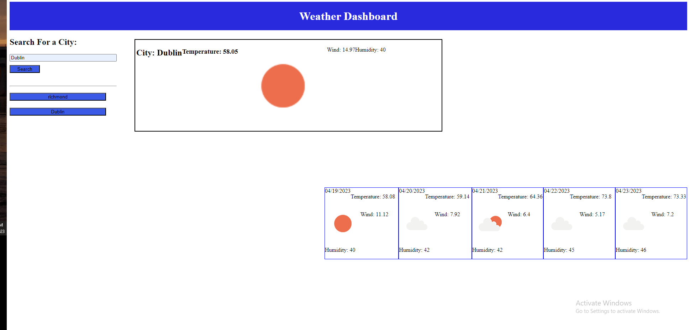

# Weather-Dashboard

## Description

In this assignment, I was tasked with creating a webpage from scratch to display a 5 day weather forecast. When the city name is typed in, the program should display the weather for the current day and the 5 following days and then save the city names.

## License

MIT License

## Screenshots

## Link to deployed webpage

https://spzweifel.github.io/Weather-Dashboard/